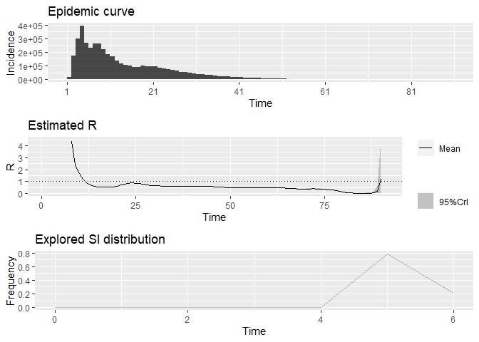

### COVID-19 in North Korea

- 신규 유열자 (new symptomatic cases) were first repoorted on May 13,
  2022 ($n$ = 18000).
- There were, however, 350000 symptomatic cases already on May 13, 2022.
- In total, 4772813 cases were reported May 13, 2022 through August 10,
  2022
- Case fatality ratio was very low: CFR = 0.0000155

<!-- -->

### $R_t$ analysis

- EpiEstim package
- 신규 유열자 was used as daily incidence
- Serial interval was was assumed to be 5.2.
- $R_t$ decreased over time and almost never reached 1

<!-- -->
