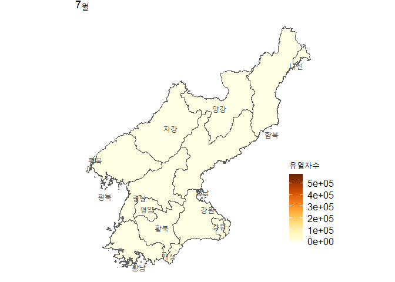

북한코로나 19
================

아래 R 패키지가 필요하다. 없을 경우는 커멘트 `#`를 제거 하고
`install.packages` 명령을 실행한다.

``` r
# install.packages("nimble")
# install.packages("rio")
# install.packages("ggplot2")
# install.packages("dplyr")
# install.packages("data.table")
# install.packages("Rcpp")
library(nimble) # Bayesian MCMC related in some files in the R folder although which is not required for this particular study  
library(rio) # data import from Excel
library(ggplot2) # plotting
library(dplyr) # data wranggling
library(data.table) # data wranggling
library(Rcpp) # model implemented in C++
library(sf) # mapping
```

R 폴더에 다양함 함수 (function, method, or subroutine)가 있어 그
파일들을 먼저 `source` 함수를 이용해 실행한다. C++ 언어로 구현된 모형
(`src/models.cpp`) 도 실행한다.

``` r
files <- list.files("R/", ".R$", full.names=TRUE)
sapply(files, source)
sourceCpp("src/models.cpp")
```

우리가 분석에 북한 코로나19 자료는 **조선중앙TV**와 **로동신문**의 일별
유열자수에 기반한다. 조선중앙TV는 지역별로 일별 유열자수를 보여주는 데
반해 로동신문 자료는 그렇지 않다. 반편 조선중앙TV는 결측자료가 많아
조선중앙TV의 지역별 일별 환자수를 모두 합해도 로동신문 자료의 일별
유열자수 보다 적다.

### 지역별 코로나19 유행 곡선

조선중앙TV 자료를 이용하여 지역별 코로나19 일별 유열자수를 플롯해 본다.
결측치는 무시하였다.

``` r
dlist <- rio::import_list("inst/extdata/(2022-0811)_코로나19_조선중앙TV_보도_현황표_시도별_일일유열자.xlsx")
nm <- names(dlist)[2:length(dlist)]
caselist <- vector("list", length(nm))
for (i in 1:length(nm)) {
  df <- dlist[[i+1]]
  # add a few columns to easier management and plotting
  df$case <- dlist[[i+1]]$`당일 발생자수`
  df$date <- extract_dates(dlist[[i+1]]$기준시)
  df$province <- nm[i]
  caselist[[i]] <- df
}
# create a data frame 
df <- do.call("rbind", caselist)
```

지역별 유행곡선 플롯하기

``` r
p <- ggplot(df, aes(date, case))+
  geom_col(fill="brown", alpha=0.5)+
  theme_bw() +
  labs(x="", y="Symptomatic case") +
  facet_wrap(~province, scales = "free_y",)
p
```

<!-- -->

시기별 (월별), 지역별 기술 분석을 위해 자료 변형

``` r
# by region and month
df$month <- ifelse(df$date < as.Date("2022-06-01"), "May", ifelse(df$date < as.Date("2022-06-30"), "June", "July")) 
df %>%
  group_by(province, month) %>%
  summarize(recovered = sum(`당일 완쾌자수`, na.rm=T), 
            deaths = sum(`당일 사망자 수`, na.rm=T),
            inf = recovered + deaths) -> df_region_month
df_region_month <- df_region_month[order(df_region_month$inf, decreasing=T),]
```

### 지역별 발병률 (attack rate)

``` r
df %>%
  group_by(province) %>%
  summarize(recovered = sum(`당일 완쾌자수`, na.rm=T), 
            deaths = sum(`당일 사망자 수`, na.rm=T),
            inf = recovered + deaths) -> df_prov 
                    
df_prov$Province_Korean = df_prov$province

# 2008 census data
popdata <- fread("inst/extdata/census_2008.csv")
popdata$province <- c("양강","함북","함남","강원","자강","평북","평남","황북","황남","평양","남포")
pop <- popdata[,c("Total", "province")]

df_prov <- left_join(df_prov, pop, by="province")
df_prov$attack_rate = 100 * df_prov$inf / df_prov$Total

# 2008 census does not provide population size for 개성 and 나선 and we include them into 황해북도, 함경남도, respectively.
# 
# 개성 = 황해북도 https://namu.wiki/w/%EA%B0%9C%EC%84%B1%EC%8B%9C
# 나선 = 함경북도 https://namu.wiki/w/%EB%9D%BC%EC%84%A0%EC%8B%9C?from=%EB%82%98%EC%84%A0%EC%8B%9C
df_prov[df_prov$province == "황북","inf"] = df_prov[df_prov$province == "황북","inf"] +  df_prov[df_prov$province == "개성","inf"] 
df_prov[df_prov$province == "함북","inf"] = df_prov[df_prov$province == "함북","inf"] +  df_prov[df_prov$province == "나선","inf"]
df_prov$attack_rate = 100 * df_prov$inf / df_prov$Total
```

지역별 발병율 지도에 표기하기

``` r
dprk <- st_read("inst/extdata/gadm41_PRK_shp/gadm41_PRK_1.shp")
```

    ## Reading layer `gadm41_PRK_1' from data source 
    ##   `G:\My Drive\Projects\COVID19NorthKorea\inst\extdata\gadm41_PRK_shp\gadm41_PRK_1.shp' 
    ##   using driver `ESRI Shapefile'
    ## Simple feature collection with 14 features and 11 fields
    ## Geometry type: MULTIPOLYGON
    ## Dimension:     XY
    ## Bounding box:  xmin: 124.1824 ymin: 37.67598 xmax: 130.6744 ymax: 43.00605
    ## Geodetic CRS:  WGS 84

``` r
dprk$name_kor = c("자강","함북","함남","황북","황남","개성","강원","강원","평북","평남","평양","나선","양강","평북")
dprk$AR = NA

nm = dprk$name_kor
for (n in nm){
  dprk[dprk$name_kor == n,]$AR = df_prov[df_prov$province == n,]$attack_rate
}
dprk[dprk$name_kor  == "개성",]$AR =
  df_prov[df_prov$province == "황북",]$attack_rate
dprk[dprk$name_kor  == "나선",]$AR =
  df_prov[df_prov$province == "함북",]$attack_rate

library(RColorBrewer)
p <- ggplot(dprk) +
  geom_sf(aes(fill=AR)) +
  scale_fill_gradientn(colors=brewer.pal(9, "YlOrBr"), name="Attack rate (%)")+
  coord_sf()+
  theme_map(legend_position = c(0.96, 0.3)) +
  theme(legend.title = element_text(size=12),
        legend.text = element_text(size=12))
p
```

<!-- -->

### 지역별 인구밀도

지역별 인구밀도는 2008년 인구조사 (census)에 기반한 인구수를 지도
(shapefile)에 기반한 면적 (`raster::area` or `sf::st_area` 함수 사용)로
나누어 계산한다. 평방킬로미터당 인구수로 표현한다.

``` r
nms_eng = dprk$NAME_1
area_df <- data.frame(province_eng = nms_eng)
area_df$area_sqkm <- rep(NA, length(nms_eng))
# raster package approach
# for (i in 1:length(nms_eng)) {
#   area_df$area_sqkm[i] <- raster::area(as(dprk[dprk$NAME_1 == nms_eng[i],], "Spatial"))/1e6
# }
for (i in 1:length(nms_eng)) {
  area_df$area_sqkm[i] <- st_area(dprk[dprk$NAME_1 == nms_eng[i],])/1e6
}

popdata$province_eng <- admin1_dprk_to_eng(popdata$Province)
pop <- popdata[,c("Total", "province", "province_eng")]
area_df <- left_join(area_df, pop, by="province_eng")
names(area_df) <- c("province_eng", "area_sqkm", "pop", "province")
area_df$pop_den <- round(area_df$pop / area_df$area_sqkm)

# "Kaesŏng" was combined with "Hwanghae-bukto" to be consistent
area_1 <- data.frame(province_eng = paste0(area_df$province_eng[4], "_", area_df$province_eng[6]))
area_1$area_sqkm <- area_df$area_sqkm[4] + area_df$area_sqkm[6]
area_1$pop <- area_df$pop[4]
area_1$pop_den <- area_1$pop/ area_1$area_sqkm
# "Rasŏn" was combined with "Hamgyŏng-bukto"
area_2 <- data.frame(province_eng = paste0(area_df$province_eng[2], "_", area_df$province_eng[12]))
area_2$area_sqkm <- area_df$area_sqkm[2] + area_df$area_sqkm[12]
area_2$pop <- area_df$pop[2]
area_2$pop_den <- area_2$pop/ area_2$area_sqkm

area_df$pop_den[4] <- area_1$pop_den
area_df$pop_den[6] <- area_1$pop_den
area_df$pop_den[2] <- area_2$pop_den
area_df$pop_den[12] <- area_2$pop_den
```

지역별 인구밀도 지도로 나타내기

``` r
dprk <- st_read("inst/extdata/gadm41_PRK_shp/gadm41_PRK_1.shp")
```

    ## Reading layer `gadm41_PRK_1' from data source 
    ##   `G:\My Drive\Projects\COVID19NorthKorea\inst\extdata\gadm41_PRK_shp\gadm41_PRK_1.shp' 
    ##   using driver `ESRI Shapefile'
    ## Simple feature collection with 14 features and 11 fields
    ## Geometry type: MULTIPOLYGON
    ## Dimension:     XY
    ## Bounding box:  xmin: 124.1824 ymin: 37.67598 xmax: 130.6744 ymax: 43.00605
    ## Geodetic CRS:  WGS 84

``` r
dprk$pop_density = NA
# area_df computed in the previous code block
for (n in dprk$NAME_1){
  dprk[dprk$NAME_1 == n,]$pop_density = area_df[area_df$province_eng  == n,]$pop_den
}

library(RColorBrewer)
p <- ggplot(dprk) +
  geom_sf(aes(fill=pop_density)) +
  scale_fill_gradientn(colors=brewer.pal(9, "YlOrBr"), name="Population density \n(per sq. km)")+
  coord_sf()+
  theme_map(legend_position = c(0.96, 0.3)) +
  theme(legend.title = element_text(size=12),
        legend.text = element_text(size=12))
p
```

<!-- -->

``` r
# Grey color indicates the areas of no information 
```

### 사망자수 및 치명률 (case fatality ratio)

노동시문 자료에 기반하여 사망자수와 치명률을 계산한다. 그리고, 코로나19
오미크론변이의 치명률에 사망률에 기반하여 예측되는 사망자수를 계산하여
본다. 오미크론 변이의 치명률은 세계 여러나라의 치명률 자료를 이용
메타분석을 실시한 [연구](https://pubmed.ncbi.nlm.nih.gov/36056540/)에
기반하였다.

``` r
d = readRDS("inst/extdata/covid_overall_20230122.rds")
x = tail(d$cumul_deaths, 1) # total deaths
n = tail(d$cumul_recovered,1) + tail(d$cumul_deaths, 1) # total cases

# 1.  Wang C, Liu B, Zhang S, Huang N, Zhao T, Lu Q-B, et al. Differences in incidence and fatality of COVID-19 by SARS-CoV-2 Omicron variant versus Delta variant in relation to vaccine coverage: A world-wide review. Journal of Medical Virology. 2023;95: e28118. doi:10.1002/jmv.28118
# 3.04 (IQR: 1.87–7.48) per 1,000
cfr_omicron = 3.04/1000
x_varied = 0:100
df1 = data.frame(x=x_varied, prob=dbinom(x=x_varied, size=n, prob=cfr_omicron))

x_varied2 = seq(14000, 15000, by=1)
df2 = data.frame(x=x_varied2, prob=dbinom(x=x_varied2, size=n, prob=cfr_omicron))

library(ggplot2)
p1 <- ggplot(df1) +
  geom_col(aes(x=x, y=prob), fill="brown") +
  geom_point(aes(74, dbinom(x, size=n, prob=cfr_omicron)),
             shape=8, size=1, stroke=1, col="blue")+
  scale_y_continuous(limits=c(0,4e-3))+
  labs(x="", y="Probability")+
  theme_minimal()+
  theme(axis.title.x = element_blank(),
        plot.margin = unit(c(5.5,-2.5,5.5,5.5),"pt"))

p2 <- ggplot(df2)+
  geom_col(aes(x=x, y=prob), fill="brown") +
  scale_y_continuous(limits=c(0,4e-3))+
  labs(x="", y="")+
  theme_minimal()+
  theme(axis.title.x = element_blank(),
        axis.ticks.y=element_blank(),
        axis.text.y=element_blank(),
        plot.margin = unit(c(5.5,5.5,5.5,-2.5),"pt"))

library(ggplot2)
library(gridExtra)
p <- grid.arrange(
  grobs=list(p1, p2),
  nrow=1, 
  widths = c(1,2),
  bottom = "Expected death")
```

<!-- -->

``` r
p
```

    ## TableGrob (2 x 2) "arrange": 3 grobs
    ##   z     cells    name                grob
    ## 1 1 (1-1,1-1) arrange      gtable[layout]
    ## 2 2 (1-1,2-2) arrange      gtable[layout]
    ## 3 3 (2-2,1-2) arrange text[GRID.text.742]

### 중환자수

중환자수는 대한민국의 백신 미접종자의 중증화율
[통계](https://www.korea.kr/briefing/pressReleaseView.do?newsId=156498586)에
기반하였다.

``` r
## 한국 중증화율 백신 미접종자의 경우 1.11%
# https://www.korea.kr/briefing/pressReleaseView.do?newsId=156498586
# 
# Expected severe cases distribution
# 방역당국이 정의한 코로나 위중증 환자는 고유량 산소요법, 인공호흡기, 
# 체외막산소공급
prop_severe_omicron = 0.0111
m <- prop_severe_omicron * n 

x_varied = seq(50000, 55000, by=1)

df = data.frame(x=x_varied, prob=dbinom(x=x_varied, size=n, prob=prop_severe_omicron))

library(ggplot2)
p <- ggplot(df) +
  geom_col(aes(x=x, y=prob), fill="steelblue") +
  scale_y_continuous()+
  labs(x="", y="Probability")+
  theme_bw()
p
```

<!-- -->

### 무증상수를 감안한 예상 감염자수 및 롱코비드 예상 환자

감염자 중 무증상자의 비율은 오미크론변이의 무증상자 비율의 메타 분석
[논문](https://onlinelibrary.wiley.com/doi/full/10.1002/jmv.28066)을
이용하였다.

``` r
d <- readRDS("inst/extdata/covid_overall_20230122.rds")
deaths <- tail(d$cumul_deaths, 1) # deaths
infecteds = tail(d$cumul_recovered,1) + tail(d$cumul_deaths, 1) # total cases
parm <- initialize_params()
parm$fA # proportion of 
```

    ## [1] 0.255

``` r
expected_inf = infecteds/(1-parm$fA)
expected_inf / parm$population
```

    ## [1] 0.246687

예상 롱코비드 환자수 계산

``` r
#4,904,963   19.1   0-14
# 43~87% Long COVID
infecteds * 0.43
```

    ## [1] 2052310

``` r
infecteds * 0.87
```

    ## [1] 4152347

``` r
# Long COVID 0-14 yo
infecteds * 0.15 * 0.19 
```

    ## [1] 136025.2

``` r
infecteds * 0.25 * 0.19
```

    ## [1] 226708.6

``` r
infecteds * 0.04 * 0.19 
```

    ## [1] 36273.38

``` r
infecteds * 0.582 * 0.19
```

    ## [1] 527777.7

### 수리모형

``` r
# cleaned dataset 
d = readRDS("inst/extdata/covid_overall_20230122.rds")

obs <- c(d$symptomatic)
# PARAMETERS is a global variable that is used in update_params, incidence, etc.
PARAMETERS <- initialize_params(tau=0.1, obs_length=length(obs))
fit = readRDS("outputs/fit_20230527.rds")
parm = fit$optim$bestmem
set.seed(1)
y <- incidence(pars=parm)
dat1 = data.frame(date=seq(from=d$date[1], by="1 day",
                           length.out=length(obs)), obs=obs)
mod1 = data.frame(date=rev(seq(from=tail(dat1$date,1)-1, by="-1 day",
                               length.out=nrow(y))), 
                  val = y[,1])

library(ggplot2)
sb <- scales::alpha(c("steelblue"), alpha = c(0.6, 0.55, 1.0)) # symptomatic
br <- scales::alpha(c("brown"), alpha = c(0.6)) # data
gr <- scales::alpha(c("darkgreen"), alpha = c(0.2, 0.55, 0.9)) # infection

p <- ggplot(mod1, aes(x=date)) +
  geom_col(data=dat1, aes(x=date, y=obs), fill=br[1], inherit.aes=F) +
  geom_line(aes(y=val, color="50%"), linewidth=1.5, color=sb[3])+
  labs(x="", y="Daily symptomatic case") +
  scale_x_date(date_breaks="2 weeks", date_labels="%Y-%m-%d",
               limits=c(min(mod1$date), max(dat1$date)))+
  theme_bw()+
  theme(axis.text.x=element_text(angle=60, hjust=1))+
  theme(legend.position=c(0.8,0.5))
p
```

<!-- -->

### 확률론적 모형

``` r
set.seed(42)
d = readRDS("inst/extdata/covid_overall_20230122.rds")
# case_before <- d$cumul_recovered[1] + d$cumul_deaths[1] - d$symptomatic[1] 
obs <- d$symptomatic
# PARAMETERS is a global variable used in other functions (eg, update_params, 
# incidence,)
PARAMETERS <- initialize_params(tau=0.1, obs_length=length(obs))
# Day 1 and Day 2 are integers
fit = readRDS("outputs/fit_20230527.rds")
parm = fit$optim$bestmem

# stochastic model
PARAMETERS$model <- seapird_tauleap
# PARAMETERS$symptomatic <- 2

nrun = 1000
set.seed(1)
y <- incidence(pars=parm)
m = matrix(NA, nrow=nrow(y), ncol=nrun)
m[,1] = y[,1]
for (i in 2:nrun) {
  set.seed(i)
  y <- incidence(pars=parm)
  m[,i] = y[,1]  
}
# plot only those with at least two cases
# min_case = 10000
# ids <- colSums(m) > min_case
# m <- m[,ids] # select only those at least one infection has been generated
sim = as.data.frame(t(apply(m, 1, quantile, probs=c(0.025,0.5,0.975))))
# sim = as.data.frame(t(apply(m, 1, quantile, probs=c(0.25,0.5,0.75))))
# colSums(sim)
## the first day represents the cumulative cases occurred before the first reporting 
dat1 = data.frame(date=seq(from=d$date[1], by="1 day",
                           length.out=length(obs)), obs=obs)
mod1 = data.frame(date=rev(seq(from=tail(dat1$date,1)-1, by="-1 day",
                               length.out=nrow(m))))
mod1 <- cbind(mod1, sim)
# mx = max(c(dat1$obs, mod1$`97.5%`), na.rm=T)
library(ggplot2)
sb <- scales::alpha(c("steelblue"), alpha = c(0.6, 0.55, 1.0)) # symptomatic
br <- scales::alpha(c("brown"), alpha = c(0.6)) # data
gr <- scales::alpha(c("darkgreen"), alpha = c(0.2, 0.55, 0.9)) # infection

p <- ggplot(mod1, aes(x=date)) +
  geom_ribbon(aes(ymax=`97.5%`,ymin=`2.5%`, fill="95% CrI"))+
  geom_col(data=dat1, aes(x=date, y=obs, fill="Data"),
           inherit.aes = F) +
  geom_line(aes(y=`50%`, color="50%"), linewidth=1.5) +
  scale_fill_manual("", values=c("95% CrI"=sb[1], "Data"=br))+
  scale_color_manual("", values=c("50%"=sb[3]))+
  labs(x="", y="Daily symptomatic case") +
  scale_x_date(date_breaks="2 weeks", date_labels="%Y-%m-%d",
               limits=c(min(mod1$date), max(dat1$date)))+
  theme_bw()+
  theme(axis.text.x=element_text(angle=60, hjust=1))+
  theme(legend.position=c(0.8,0.5))
p
```

<!-- -->
