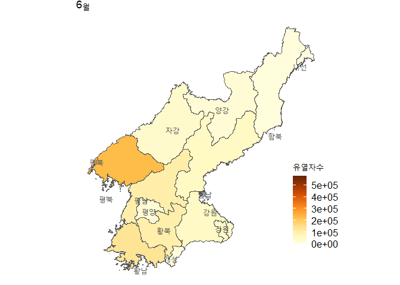
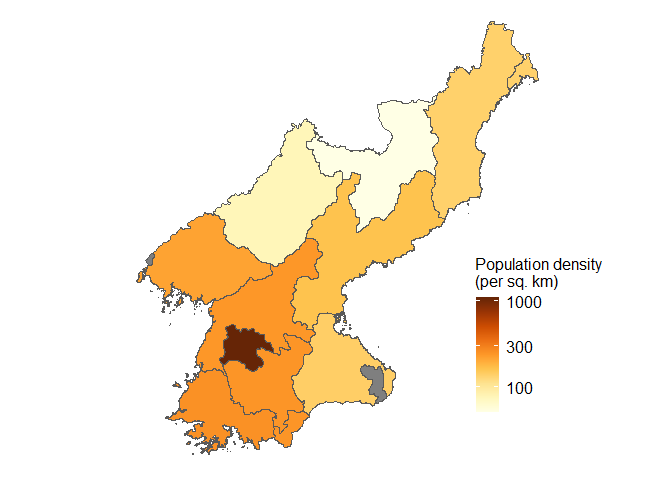
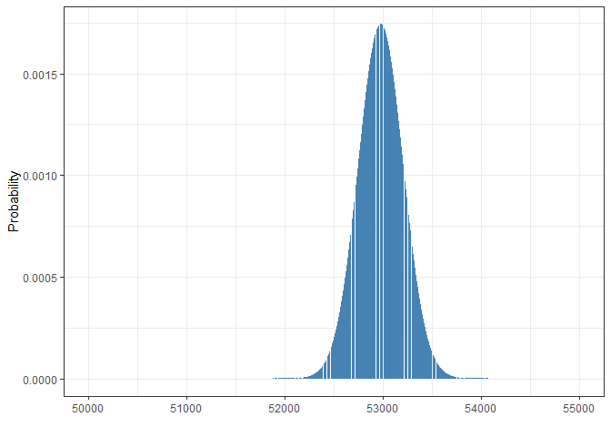
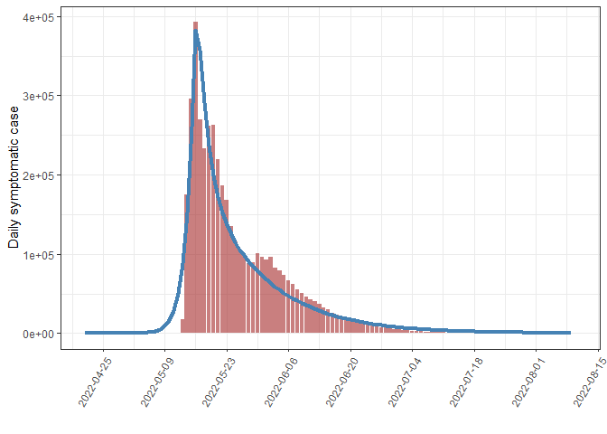
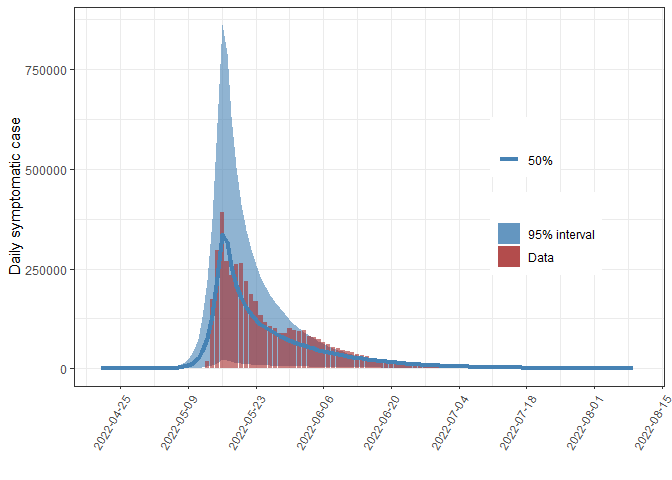
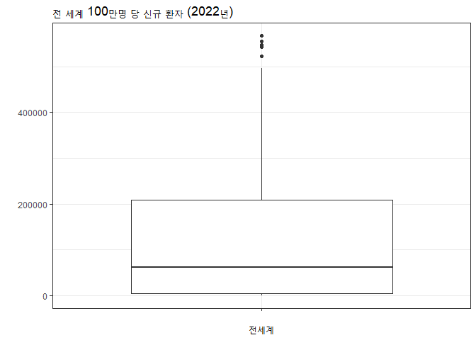
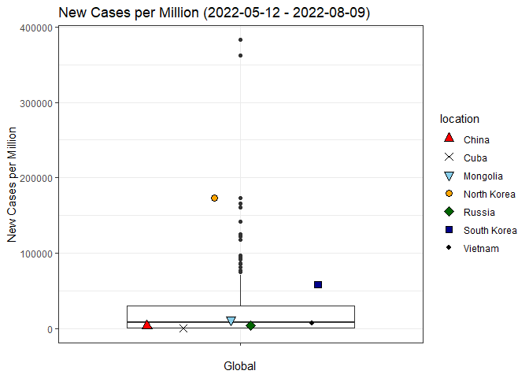
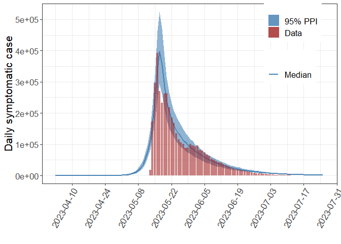

북한코로나 19
================

## 개요

이 문서는 북한 코로나19 프로젝트 기술분석 (descriptive analysis)과
수리모형 (mathematical model)을 이용한 분석에 사용된 `R` 코드와 설명을
포함한다.

### 패키지 설치 및 로딩

아래에 있는 몇 가지 R 패키지가 필요하다. R 패키지를 기존에 install 하지
않은 경우에는 커멘트 (`#`)를 제거 하고 `install.packages` 명령을
실행한다.

``` r
library(nimble) # Bayesian MCMC related in some files in the R folder although which is not required for this particular study  
library(rio) # data import from Excel
library(ggplot2) # plotting
library(dplyr) # data wrangling
library(tidyr) # data wrangling
library(data.table) # data wranggling
library(Rcpp) # model implemented in C++
library(sf) # mapping
library(lubridate) # date
library(readxl) # excel
library(scales) # color scales for plotting
library(readr)
library(gridExtra)
```

R 폴더에 다양함 함수 (function, method, or subroutine)가 있어 그
파일들을 먼저 `source` 함수를 이용해 실행한다. C++ 언어로 구현된 모형
(`src/models.cpp`) 도 실행한다.

``` r
files <- list.files("R/", ".R$", full.names=TRUE)
sapply(files, source)
sourceCpp("src/models.cpp")
```

우리가 분석에 북한 코로나19 자료는 **조선중앙TV**와 **로동신문**의 일별
유열자수에 기반한다. 조선중앙TV는 지역별로 일별 유열자수를 보여주는 데
반해 로동신문 자료는 그렇지 않다. 반편 조선중앙TV는 결측자료가 많아
조선중앙TV의 지역별 일별 환자수를 모두 합해도 로동신문 자료의 일별
유열자수 보다 적다.

### 지역별 기술 분석 요약표

COVID-19 북한 지역 데이터를 로드하고 분석. 북한의 COVID-19 관련 데이터를
처리하고, 각 지역 및 전체에 대한 요약 테이블을 생성한다.

``` r
# COVID-19 데이터를 불러옴
dlist <- rio::import_list("inst/extdata/(2022-0811)_코로나19_조선중앙TV_보도_현황표_시도별_일일유열자.xlsx")

# 지역명 추출
nm <- names(dlist)[2:length(dlist)]

# 데이터를 저장할 빈 리스트 생성
caselist <- vector("list", length(nm))

# 각 지역 데이터 병합
for (i in 1:length(nm)) {
  # df <- data.frame(case = dlist[[i+1]]$`당일 발생자수`)
  df <- dlist[[i+1]]
  # add a few columns to easier management and plotting
  df$case <- dlist[[i+1]]$`당일 발생자수`
  df$date <- extract_dates(dlist[[i+1]]$기준시)
  df$province <- nm[i]
  caselist[[i]] <- df
}

# 데이터 프레임 결합
df <- do.call("rbind", caselist)

# 시도명 (Province) | 초기 날짜 (Initial Date) | 최종 날짜 (Final Date) | 기간 (Duration) | 일일 최대 발생자 날짜 (Date of the Highest Daily New Cases) | 일일 최대 발생자 수 (Maximum Daily New Cases) | 누적 발생자 수 (Cumulative Cases) | 누적 완쾌자 수 (Cumulative Recovered Cases) | 누적 사망자 수 (Cumulative Death Cases) | 인구 수 (Population) | 발병률 (Incidence Rate)


# 결측치가 있는 행을 제거
df <- subset(df, !is.na(case))

# 지역별 요약 테이블 생성
df_ds <- df %>%
  group_by(province) %>%
  summarize(
    initial_date         = min(date[case != 0]),
    final_date           = max(date[case != 0]),
    duration             = as.numeric(difftime(final_date, initial_date, units="days")) + 1,
    max_daily_cases_date = date[which.max(case)],
    max_daily_cases      = max(case),
    adding_new_cases     = sum(case),
    cumulative_recovered = sum(`당일 완쾌자수`, na.rm=T),
    cumulative_deaths    = sum(`당일 사망자 수`, na.rm=T),
    cumulative_cases     = cumulative_recovered + cumulative_deaths)

# 인구 데이터 불러오기

# 2008 census data
popdata <- fread("inst/extdata/census_2008.csv")
popdata$Province_Korean <- c("양강","함북","함남","강원","자강","평북","평남","황북","황남","평양","남포")

pop = popdata[,c("Total", "Province_Korean", "Province")]
pop$Province[pop$Province == "Kangwon"] <- "Gangwon"

# 지역 데이터와 인구 데이터 결합
df_ds$Province_Korean = df_ds$province
df_ds = left_join(df_ds, pop, by="Province_Korean")

# Rasonn City merged with Hamgyeongbuk-do Province, and Kaesong merged with Hwanghaebuk-do Province.

# 지역 데이터 병합
df_ds[df_ds$province == "황북","adding_new_cases"] = df_ds[df_ds$province == "황북","adding_new_cases"] +  df_ds[df_ds$province == "개성","adding_new_cases"] 
df_ds[df_ds$province == "함북","adding_new_cases"] = df_ds[df_ds$province == "함북","adding_new_cases"] +  df_ds[df_ds$province == "나선","adding_new_cases"]

df_ds[df_ds$province == "황북","cumulative_recovered"] = df_ds[df_ds$province == "황북","cumulative_recovered"] +  df_ds[df_ds$province == "개성","cumulative_recovered"] 
df_ds[df_ds$province == "함북","cumulative_recovered"] = df_ds[df_ds$province == "함북","cumulative_recovered"] +  df_ds[df_ds$province == "나선","cumulative_recovered"]

df_ds[df_ds$province == "황북","cumulative_deaths"] = df_ds[df_ds$province == "황북","cumulative_deaths"] +  df_ds[df_ds$province == "개성","cumulative_deaths"] 
df_ds[df_ds$province == "함북","cumulative_deaths"] = df_ds[df_ds$province == "함북","cumulative_deaths"] +  df_ds[df_ds$province == "나선","cumulative_deaths"]

df_ds[df_ds$province == "황북","cumulative_cases"] = df_ds[df_ds$province == "황북","cumulative_cases"] +  df_ds[df_ds$province == "개성","cumulative_cases"] 
df_ds[df_ds$province == "함북","cumulative_cases"] = df_ds[df_ds$province == "함북","cumulative_cases"] +  df_ds[df_ds$province == "나선","cumulative_cases"]

# Attack rate 계산
df_ds$attack_rate = round(100 * df_ds$cumulative_cases / df_ds$Total, digits = 1)
df_ds <- df_ds[order(df_ds$Province),]

# 테이블 포맷팅
summary_table <- df_ds
summary_table <- summary_table[!summary_table$province %in% c("개성", "나선"), ]
summary_table$attack_rate_percent   <- paste0(summary_table$attack_rate,"%")
summary_table$max_daily_cases       <- sapply(summary_table$max_daily_cases, format, big.mark = ",")
summary_table$adding_new_cases      <- sapply(summary_table$adding_new_cases, format, big.mark = ",")
summary_table$cumulative_recovered  <- sapply(summary_table$cumulative_recovered, format, big.mark = ",")
summary_table$cumulative_deaths     <- sapply(summary_table$cumulative_deaths, format, big.mark = ",")
summary_table$cumulative_cases      <- sapply(summary_table$cumulative_cases, format, big.mark = ",")
summary_table$Total                 <- sapply(summary_table$Total, format, big.mark = ",")

summary_table_kr <- summary_table[, c("province", "initial_date", "final_date", 
                           "duration", "max_daily_cases_date", "max_daily_cases", 
                           "cumulative_cases", "cumulative_recovered", "cumulative_deaths" , 
                           "Total", "attack_rate_percent")]

# 한글로 된 요약 테이블을 CSV 파일로 저장 (<표> 지역별 발병률)
summary_table_kr <- summary_table_kr[order(summary_table_kr$province), ]

# write.csv(summary_table_kr, file = "outputs/summary_table_kr.csv", row.names = FALSE)

df_cases_all <- df %>%
  summarize(
    Province             = "Korean Central TV Total", 
    adding_new_cases     = sum(case),
    cumulative_recovered = sum(`당일 완쾌자수`),
    cumulative_deaths    = sum(`당일 사망자 수`),
    cumulative_cases     = cumulative_recovered + cumulative_deaths)

df_cases_all$adding_new_cases     <- sapply(df_cases_all$adding_new_cases, format, big.mark = ",")
df_cases_all$cumulative_recovered <- sapply(df_cases_all$cumulative_recovered, format, big.mark = ",")
df_cases_all$cumulative_deaths    <- sapply(df_cases_all$cumulative_deaths, format, big.mark = ",")
df_cases_all$cumulative_cases     <- sapply(df_cases_all$cumulative_cases, format, big.mark = ",")

# 지역별 계산

# 지역별 데이터 프레임 생성
df_cases_region_kr <- summary_table[, c("province",
                             "adding_new_cases", "cumulative_recovered", 
                             "cumulative_deaths", "cumulative_cases")]

# 한국어로 된 데이터 프레임을 알파벳 순으로 정렬
df_cases_region_kr <- df_cases_region_kr[order(df_cases_region_kr$province), ]

# 첫 번째 열의 열 이름을 "Province"로 변경
colnames(df_cases_region_kr)[1] <- "Province"

df_cases_kr <- rbind(df_cases_region_kr, df_cases_all)

names(df_cases_kr) <- c("지역", "누적 신규 유열자", 
                        "누적 신규 회복", "누적 신규 사망", "누적 환자")

df_cases_kr
```

    ## # A tibble: 12 × 5
    ##    지역         `누적 신규 유열자` `누적 신규 회복` `누적 신규 사망` `누적 환자`
    ##    <chr>        <chr>              <chr>            <chr>            <chr>      
    ##  1 강원         225,445            258,248          7                258,255    
    ##  2 남포         133,089            149,035          0                149,035    
    ##  3 양강         114,316            129,966          8                129,974    
    ##  4 자강         125,578            156,617          0                156,617    
    ##  5 평남         425,965            437,789          5                437,794    
    ##  6 평북         354,206            388,616          1                388,617    
    ##  7 평양         608,063            662,337          12               662,349    
    ##  8 함남         245,487            257,001          2                257,003    
    ##  9 함북         112,545            141,092          1                141,093    
    ## 10 황남         359,760            351,613          3                351,616    
    ## 11 황북         412,794            432,810          1                432,811    
    ## 12 Korean Cent… 3,117,248          3,365,124        40               3,365,164

``` r
# CSV 파일로 저장 (<표>  신규 유열자, 당일 완쾌자, 당일 사망자 합계)
# write.csv(df_cases_kr, file = "outputs/summary_table_total_kr.csv", row.names = FALSE)
```

### 로동신문과 조선중앙TV 데이터 비교

노동신문과 조선중앙TV 데이터 날짜별 비교 (기준시). 조선중앙TV와
노동신문의 COVID-19 데이터를 날짜별로 비교하고, 결과를 CSV 파일로
출력한다.

``` r
# 조선중앙TV 데이터를 기준일(date)로 그룹화하고 요약
summary_dates_KCTV <- df %>% group_by(date) %>%
  summarize("신규 유열자(조선중앙TV)" = sum(case),
            "완쾌자 (조선중앙TV)"     = sum(`당일 완쾌자수`),
            "사망자 (조선중앙TV)"     = sum(`당일 사망자 수`))

# 노동신문 데이터를 읽어오기
summary_dates_labor <- read_excel("inst/extdata/(2022-0811)_코로나19_노동신문_보도_현황표_전체_일일유열자 2.xlsx")

# 열 이름 변경
names(summary_dates_labor) <- c("기준일", "신규 유열자(노동신문)", "완쾌자(노동신문)", "사망자(노동신문)")

# 기준일을 기준으로 두 데이터 프레임을 결합
summary_dates <- left_join(summary_dates_labor, summary_dates_KCTV, by = c("기준일" = "date"))

summary_dates$`완쾌자(노동신문)` <- as.numeric(summary_dates$`완쾌자(노동신문)`)

# 숫자를 천 단위로 쉼표로 포맷팅
summary_dates_table <- summary_dates %>%
  mutate(across(2:7, ~ format(., big.mark = ",")))

# 각 열의 "NA" 값을 "-"로 대체
summary_dates_table <- as.data.frame(apply(summary_dates_table , 2, function(x) gsub("^\\s*NA$", "-", x)))
summary_dates_table$기준일 <- format(as.Date(summary_dates_table$기준일), "%Y/%m/%d")

head(summary_dates_table)
```

    ##       기준일 신규 유열자(노동신문) 완쾌자(노동신문) 사망자(노동신문)
    ## 1 2022/05/12                18,000                -               - 
    ## 2 2022/05/13               174,440           81,430               21
    ## 3 2022/05/14               296,180          252,400               15
    ## 4 2022/05/15               392,920          152,600               8 
    ## 5 2022/05/16               269,510          170,460               6 
    ## 6 2022/05/17               232,880          205,630               6 
    ##   신규 유열자(조선중앙TV) 완쾌자 (조선중앙TV) 사망자 (조선중앙TV)
    ## 1                       -                   -                   -
    ## 2                       -                   -                   -
    ## 3                 218,188             214,251                  15
    ## 4                 354,284             130,777                   8
    ## 5                       -                   -                   -
    ## 6                 193,162             156,940                   6

``` r
# CSV 파일로 저장 (<표>  신규 유열자, 완쾌자, 사망자 일별 자료)
# write.csv(summary_dates_table, file = "outputs/summary_dates.csv", row.names = FALSE)
```

### 일별 유열자수

로동신문과 조선중앙TV 자료원을 사용하여 일별 유열자 수를 시각화한다.

``` r
# 데이터 프레임 변환
df_long <- summary_dates %>%
   tidyr::pivot_longer(cols = c(`신규 유열자(조선중앙TV)`, `신규 유열자(노동신문)`), 
                      names_to = "source", values_to = "case")
df_long$기준일 <- as.Date(df_long$기준일, format="%Y-%m-%d")


# 두 자료원 트렌드 한 그래프에 나타내기
p2_kr <- ggplot(df_long, aes(x = 기준일, y = case)) +
  geom_col(data = subset(df_long, source == "신규 유열자(노동신문)"), aes(fill = source), alpha = 0.2) +
  geom_col(data = subset(df_long, source == "신규 유열자(조선중앙TV)"), aes(fill = source), alpha = 0.5) +
  scale_fill_manual(values = c("blue", "brown"), labels = c("신규 유열자 (노동신문)", "신규 유열자 (조선중앙TV)"), name = "Data Source") +
  theme_bw() +
  labs(x = "", y = "유열자 수") +
  scale_y_continuous(labels = scales::comma) +
  theme(
    axis.title.y = element_text(margin = margin(t = 0, r = 10, b = 0, l = 0)),
    legend.title = element_blank(),
    legend.position = c(0.75, 0.85)  # Adjust the values to control the position of the legend
  )

p2_kr
```

<!-- -->

``` r
# 그래프를 파일로 저장 ([그림] 두 자료원의 신규 유열자 추이 비교)
# ggsave("plots/plot_dates2_kr.png", plot = p2_kr, width = 6.5, height = 4.5, dpi = 300)

# 두 자료원 트렌드 한 그래프에 나타내기
p2_eng <- ggplot(df_long, aes(x = 기준일, y = case)) +
  geom_col(data = subset(df_long, source == "신규 유열자(노동신문)"), aes(fill = source), alpha = 0.3) +
  geom_col(data = subset(df_long, source == "신규 유열자(조선중앙TV)"), aes(fill = source), alpha = 0.5) +
  scale_fill_manual(values = c("blue", "brown"), labels = c("Labor Daily", "Chosun Joongang TV"), name = "Data Source") +
  theme_bw() +
  labs(x = "", y = "Fever cases") +
  scale_y_continuous(labels = scales::comma) +
  theme(
    axis.title.y = element_text(margin = margin(t = 0, r = 10, b = 0, l = 0)),
    legend.title = element_blank(),
    legend.position = c(0.75, 0.85),
    text = element_text(size=16),
    axis.text = element_text(size=13),
    legend.text=element_text(size=13)
  )

# ggsave(paste0("plots/daily_fever_eng_", tstamp(), ".png"), p, width=3.4*2, height=2.7*2)
```

### 월별 유열자수 지도에 표기

5월, 6월, 7월에 대한 한국의 지역별 COVID-19 환자 수를 처리하고 지도에
나타낸다.

``` r
df_month <- df
df_month$month <- month.name[month(ymd(df_month$date))]

# 월별로 지역별 유열자 수를 집계
df_month <- df_month %>%
  group_by(month, province) %>%
  summarize(adding_new_cases = sum(case))

# 각 월별 데이터 추출 (May, June, July)
df_May  <- df_month[df_month$month == "May",]
df_June <- df_month[df_month$month == "June",]
df_July <- df_month[df_month$month == "July",]

# 지도 데이터 로드
dprk = sf::st_read("inst/extdata/gadm41_PRK_shp/gadm41_PRK_1.shp")
```

    ## Reading layer `gadm41_PRK_1' from data source 
    ##   `G:\My Drive\Projects\COVID19NorthKorea\inst\extdata\gadm41_PRK_shp\gadm41_PRK_1.shp' 
    ##   using driver `ESRI Shapefile'
    ## Simple feature collection with 14 features and 11 fields
    ## Geometry type: MULTIPOLYGON
    ## Dimension:     XY
    ## Bounding box:  xmin: 124.1824 ymin: 37.67598 xmax: 130.6744 ymax: 43.00605
    ## Geodetic CRS:  WGS 84

``` r
dprk$name_kor = c("자강","함북","함남","황북","황남","개성","강원","강원","평북","평남","평양","나선","양강","평북")

dprk$cases_May <- NA
dprk$cases_June <- NA
dprk$cases_July <- NA

# 월별 유열자 수를 지도 데이터에 할당
for (n in dprk$name_kor){
  dprk[dprk$name_kor == n,]$cases_May = df_May[df_May$province == n,]$adding_new_cases 
  dprk[dprk$name_kor == n,]$cases_June = df_June[df_June$province == n,]$adding_new_cases 
  dprk[dprk$name_kor == n,]$cases_July = df_July[df_July$province == n,]$adding_new_cases
}
# 지역명 추가
loc <- as.data.frame(t(sapply(1:14, function(x) colMeans(dprk$geometry[[x]][[1]][1][[1]]))))
names(loc) <- c("lon","lat")
labels = cbind(data.frame(name=dprk$name_kor), loc)
```

5월

``` r
library(RColorBrewer)
plt_May <- ggplot(dprk) +
  geom_sf(aes(fill=cases_May)) +
  geom_text(data = labels, aes(x=lon, y=lat, label=name), size=4, color="#505050")+
  scale_fill_gradientn(colors=brewer.pal(9, "YlOrBr"), name="유열자수",                       limits=c(0,max(dprk$cases_May)))+
  coord_sf()+
  theme_map(legend_position = c(0.96, 0.3)) +
  theme(legend.title = element_text(size=12),
        legend.text = element_text(size=12)) +
  ggtitle("5월")
plt_May
```

<!-- -->

6월

``` r
plt_June <- ggplot(dprk) +
  geom_sf(aes(fill=cases_June)) +
  geom_text(data = labels, aes(x=lon, y=lat, label=name), size=4, color="#505050")+
  scale_fill_gradientn(colors=brewer.pal(9, "YlOrBr"), name="유열자수",
                       limits=c(0,max(dprk$cases_May)))+
  coord_sf()+
  theme_map(legend_position = c(0.96, 0.3)) +
  theme(legend.title = element_text(size=12),
        legend.text = element_text(size=12)) +
  ggtitle("6월")
plt_June
```

<!-- -->

7월

``` r
plt_July <- ggplot(dprk) +
  geom_sf(aes(fill=cases_July)) +
  geom_text(data = labels, aes(x=lon, y=lat, label=name), size=4, color="#505050")+
  scale_fill_gradientn(colors=brewer.pal(9, "YlOrBr"), name="유열자수",
                       limits=c(0,max(dprk$cases_May)))+
  coord_sf()+
  theme_map(legend_position = c(0.96, 0.3)) +
  theme(legend.title = element_text(size=12),
        legend.text = element_text(size=12)) +
  ggtitle("7월")

plt_July
```

<!-- -->

``` r
# grid.arrange(plt_May, plt_June, plt_July, nrow=1)
```

### 지역별 코로나19 유행 곡선

조선중앙TV 자료를 이용하여 지역별 코로나19 일별 유열자수를 플롯해 본다.
결측치는 무시하였다.

``` r
dlist <- rio::import_list("inst/extdata/(2022-0811)_코로나19_조선중앙TV_보도_현황표_시도별_일일유열자.xlsx")
nm <- names(dlist)[2:length(dlist)]
caselist <- vector("list", length(nm))
for (i in 1:length(nm)) {
  df <- dlist[[i+1]]
  # add a few columns to easier management and plotting
  df$case <- dlist[[i+1]]$`당일 발생자수`
  df$date <- extract_dates(dlist[[i+1]]$기준시)
  df$province <- nm[i]
  caselist[[i]] <- df
}
# create a data frame 
df <- do.call("rbind", caselist)
```

지역별 유행곡선 플롯하기

``` r
p <- ggplot(df, aes(date, case))+
  geom_col(fill="brown", alpha=0.5)+
  theme_bw() +
  # labs(x="", y="Symptomatic case") +
   labs(x="", y="일별 유열자 수") +
  facet_wrap(~province, scales = "free_y",)
p
```

<!-- -->

``` r
# ggsave(paste0("plots/daily_fever_region_", tstamp(), ".png"), p, width=3.4*3, height=2.7*3)
```

시기별 (월별), 지역별 기술 분석을 위해 자료 변형

``` r
# by region and month
df$month <- ifelse(df$date < as.Date("2022-06-01"), "May", ifelse(df$date < as.Date("2022-06-30"), "June", "July")) 
df %>%
  group_by(province, month) %>%
  summarize(recovered = sum(`당일 완쾌자수`, na.rm=T), 
            deaths = sum(`당일 사망자 수`, na.rm=T),
            inf = recovered + deaths) -> df_region_month
df_region_month <- df_region_month[order(df_region_month$inf, decreasing=T),]
```

### 지역별 발병률 (attack rate)

``` r
df %>%
  group_by(province) %>%
  summarize(recovered = sum(`당일 완쾌자수`, na.rm=T), 
            deaths = sum(`당일 사망자 수`, na.rm=T),
            inf = recovered + deaths) -> df_prov 
                    
df_prov$Province_Korean = df_prov$province

# 2008 census data
popdata <- fread("inst/extdata/census_2008.csv")
popdata$province <- c("양강","함북","함남","강원","자강","평북","평남","황북","황남","평양","남포")
pop <- popdata[,c("Total", "province")]

df_prov <- left_join(df_prov, pop, by="province")
df_prov$attack_rate = 100 * df_prov$inf / df_prov$Total

# 2008 census does not provide population size for 개성 and 나선 and we include them into 황해북도, 함경남도, respectively.
# 
# 개성 = 황해북도 https://namu.wiki/w/%EA%B0%9C%EC%84%B1%EC%8B%9C
# 나선 = 함경북도 https://namu.wiki/w/%EB%9D%BC%EC%84%A0%EC%8B%9C?from=%EB%82%98%EC%84%A0%EC%8B%9C
df_prov[df_prov$province == "황북","inf"] = df_prov[df_prov$province == "황북","inf"] +  df_prov[df_prov$province == "개성","inf"] 
df_prov[df_prov$province == "함북","inf"] = df_prov[df_prov$province == "함북","inf"] +  df_prov[df_prov$province == "나선","inf"]
df_prov$attack_rate = 100 * df_prov$inf / df_prov$Total
```

지역별 발병율 지도에 표기하기

``` r
dprk <- st_read("inst/extdata/gadm41_PRK_shp/gadm41_PRK_1.shp")
```

    ## Reading layer `gadm41_PRK_1' from data source 
    ##   `G:\My Drive\Projects\COVID19NorthKorea\inst\extdata\gadm41_PRK_shp\gadm41_PRK_1.shp' 
    ##   using driver `ESRI Shapefile'
    ## Simple feature collection with 14 features and 11 fields
    ## Geometry type: MULTIPOLYGON
    ## Dimension:     XY
    ## Bounding box:  xmin: 124.1824 ymin: 37.67598 xmax: 130.6744 ymax: 43.00605
    ## Geodetic CRS:  WGS 84

``` r
dprk$name_kor = c("자강","함북","함남","황북","황남","개성","강원","강원","평북","평남","평양","나선","양강","평북")
dprk$AR = NA

nm = dprk$name_kor
for (n in nm){
  dprk[dprk$name_kor == n,]$AR = df_prov[df_prov$province == n,]$attack_rate
}
dprk[dprk$name_kor  == "개성",]$AR =
  df_prov[df_prov$province == "황북",]$attack_rate
dprk[dprk$name_kor  == "나선",]$AR =
  df_prov[df_prov$province == "함북",]$attack_rate

library(RColorBrewer)
p <- ggplot(dprk) +
  geom_sf(aes(fill=AR)) +
  scale_fill_gradientn(colors=brewer.pal(9, "YlOrBr"), name="Attack rate (%)")+
  coord_sf()+
  theme_map(legend_position = c(0.96, 0.3)) +
  theme(legend.title = element_text(size=12),
        legend.text = element_text(size=12))
p
```

<!-- -->

### 지역별 인구밀도

지역별 인구밀도는 2008년 인구조사 (census)에 기반한 인구수를 지도
(shapefile)에 기반한 면적 (`raster::area` or `sf::st_area` 함수 사용)로
나누어 계산한다. 평방킬로미터당 인구수로 표현한다.

``` r
nms_eng = dprk$NAME_1
area_df <- data.frame(province_eng = nms_eng)
area_df$area_sqkm <- rep(NA, length(nms_eng))
# raster package approach
# for (i in 1:length(nms_eng)) {
#   area_df$area_sqkm[i] <- raster::area(as(dprk[dprk$NAME_1 == nms_eng[i],], "Spatial"))/1e6
# }
for (i in 1:length(nms_eng)) {
  area_df$area_sqkm[i] <- st_area(dprk[dprk$NAME_1 == nms_eng[i],])/1e6
}

popdata$province_eng <- admin1_dprk_to_eng(popdata$Province)
pop <- popdata[,c("Total", "province", "province_eng")]
area_df <- left_join(area_df, pop, by="province_eng")
names(area_df) <- c("province_eng", "area_sqkm", "pop", "province")
area_df$pop_den <- round(area_df$pop / area_df$area_sqkm)

# "Kaesŏng" was combined with "Hwanghae-bukto" to be consistent
area_1 <- data.frame(province_eng = paste0(area_df$province_eng[4], "_", area_df$province_eng[6]))
area_1$area_sqkm <- area_df$area_sqkm[4] + area_df$area_sqkm[6]
area_1$pop <- area_df$pop[4]
area_1$pop_den <- area_1$pop/ area_1$area_sqkm
# "Rasŏn" was combined with "Hamgyŏng-bukto"
area_2 <- data.frame(province_eng = paste0(area_df$province_eng[2], "_", area_df$province_eng[12]))
area_2$area_sqkm <- area_df$area_sqkm[2] + area_df$area_sqkm[12]
area_2$pop <- area_df$pop[2]
area_2$pop_den <- area_2$pop/ area_2$area_sqkm

area_df$pop_den[4] <- area_1$pop_den
area_df$pop_den[6] <- area_1$pop_den
area_df$pop_den[2] <- area_2$pop_den
area_df$pop_den[12] <- area_2$pop_den
```

지역별 인구밀도 지도로 나타내기

``` r
dprk <- st_read("inst/extdata/gadm41_PRK_shp/gadm41_PRK_1.shp")
```

    ## Reading layer `gadm41_PRK_1' from data source 
    ##   `G:\My Drive\Projects\COVID19NorthKorea\inst\extdata\gadm41_PRK_shp\gadm41_PRK_1.shp' 
    ##   using driver `ESRI Shapefile'
    ## Simple feature collection with 14 features and 11 fields
    ## Geometry type: MULTIPOLYGON
    ## Dimension:     XY
    ## Bounding box:  xmin: 124.1824 ymin: 37.67598 xmax: 130.6744 ymax: 43.00605
    ## Geodetic CRS:  WGS 84

``` r
dprk$pop_density = NA
# area_df computed in the previous code block
for (n in dprk$NAME_1){
  dprk[dprk$NAME_1 == n,]$pop_density = area_df[area_df$province_eng  == n,]$pop_den
}
dprk$log_pop_density = log(dprk$pop_density)

library(RColorBrewer)
p <- ggplot(dprk) +
  geom_sf(aes(fill=pop_density)) +
  scale_fill_gradientn(trans="log10", colors=brewer.pal(9, "YlOrBr"), name="Population density \n(per sq. km)")+
  coord_sf()+
  theme_map(legend_position = c(0.96, 0.3)) +
  theme(legend.title = element_text(size=12),
        legend.text = element_text(size=12))
p
```

<!-- -->

``` r
# Grey color indicates the areas of no information 
# ggsave(paste0("plots/popden_", tstamp(), ".png"), p, width=3.4*2, height=2.7*2)
```

### 발병율과 인구 밀도 상관관계 분석

``` r
df <- left_join(df_prov, area_df, by="province")
df$log_pop_den <- log(df$pop_den)
cor.test(df$pop_den, df$attack_rate)
```

    ## 
    ##  Pearson's product-moment correlation
    ## 
    ## data:  df$pop_den and df$attack_rate
    ## t = 1.8582, df = 8, p-value = 0.1002
    ## alternative hypothesis: true correlation is not equal to 0
    ## 95 percent confidence interval:
    ##  -0.1231105  0.8758947
    ## sample estimates:
    ##       cor 
    ## 0.5490767

``` r
cor.test(df$log_pop_den, df$attack_rate)
```

    ## 
    ##  Pearson's product-moment correlation
    ## 
    ## data:  df$log_pop_den and df$attack_rate
    ## t = 1.2889, df = 8, p-value = 0.2335
    ## alternative hypothesis: true correlation is not equal to 0
    ## 95 percent confidence interval:
    ##  -0.2909136  0.8280905
    ## sample estimates:
    ##       cor 
    ## 0.4146658

``` r
library(ggplot2)
p <- ggplot(df,aes(pop_den, attack_rate)) +
  geom_point()+
  geom_smooth(method="lm", level=0.95) +
  labs(x="Population density (per sq. km)", y="Attack rate (%)") +
  theme_bw() +
  theme(legend.title = element_blank(),
        legend.position = "bottom",
        text = element_text(size=16),
        axis.text = element_text(size=13),
        legend.text=element_text(size=13))
p
```

<!-- -->

``` r
# ggsave(paste0("plots/ar_popden_", tstamp(), ".png"), p, width=3.4*2, height=2.7*2)

# library(ggplot2)
# p <- ggplot(df,aes(log_pop_den, attack_rate)) +
#   geom_point()+
#   geom_smooth(method="lm", level=0.95) +
#   labs(x="Population density (per sq. km)", y="Attack rate (%)") +
#   theme_bw() +
#   theme(legend.title = element_blank(),
#         legend.position = "bottom",
#         text = element_text(size=16),
#         axis.text = element_text(size=13),
#         legend.text=element_text(size=13))
# p
# ggsave(paste0("plots/ar_logpopden_", tstamp(), ".png"), p, width=3.4*2, height=2.7*2)
```

### 사망자수 및 치명률 (case fatality ratio)

노동시문 자료에 기반하여 사망자수와 치명률을 계산한다. 그리고, 코로나19
오미크론변이의 치명률에 사망률에 기반하여 예측되는 사망자수를 계산하여
본다. 오미크론 변이의 치명률은 세계 여러나라의 치명률 자료를 이용
메타분석을 실시한 [연구](https://pubmed.ncbi.nlm.nih.gov/36056540/)에
기반하였다.

``` r
d = readRDS("inst/extdata/covid_overall_20230122.rds")
x = tail(d$cumul_deaths, 1) # total deaths
n = tail(d$cumul_recovered,1) + tail(d$cumul_deaths, 1) # total cases

# 1.  Wang C, Liu B, Zhang S, Huang N, Zhao T, Lu Q-B, et al. Differences in incidence and fatality of COVID-19 by SARS-CoV-2 Omicron variant versus Delta variant in relation to vaccine coverage: A world-wide review. Journal of Medical Virology. 2023;95: e28118. doi:10.1002/jmv.28118
# 3.04 (IQR: 1.87–7.48) per 1,000
cfr_omicron = 3.04/1000
x_varied = 0:100
df1 = data.frame(x=x_varied, prob=dbinom(x=x_varied, size=n, prob=cfr_omicron))

x_varied2 = seq(14000, 15000, by=1)
df2 = data.frame(x=x_varied2, prob=dbinom(x=x_varied2, size=n, prob=cfr_omicron))

library(ggplot2)
p1 <- ggplot(df1) +
  geom_col(aes(x=x, y=prob), fill="brown") +
  geom_point(aes(74, dbinom(x, size=n, prob=cfr_omicron)),
             shape=8, size=1, stroke=1, col="blue")+
  scale_y_continuous(limits=c(0,4e-3))+
  labs(x="", y="Probability")+
  theme_minimal()+
  theme(axis.title.x = element_blank(),
        plot.margin = unit(c(5.5,-2.5,5.5,5.5),"pt"))

p2 <- ggplot(df2)+
  geom_col(aes(x=x, y=prob), fill="brown") +
  scale_y_continuous(limits=c(0,4e-3))+
  labs(x="", y="")+
  theme_minimal()+
  theme(axis.title.x = element_blank(),
        axis.ticks.y=element_blank(),
        axis.text.y=element_blank(),
        plot.margin = unit(c(5.5,5.5,5.5,-2.5),"pt"))

library(ggplot2)
library(gridExtra)
p <- grid.arrange(
  grobs=list(p1, p2),
  nrow=1, 
  widths = c(1,2),
  bottom = "Expected death")
```

<!-- -->

``` r
p
```

    ## TableGrob (2 x 2) "arrange": 3 grobs
    ##   z     cells    name                grob
    ## 1 1 (1-1,1-1) arrange      gtable[layout]
    ## 2 2 (1-1,2-2) arrange      gtable[layout]
    ## 3 3 (2-2,1-2) arrange text[GRID.text.936]

### 중환자수

중환자수는 대한민국의 백신 미접종자의 중증화율
[통계](https://www.korea.kr/briefing/pressReleaseView.do?newsId=156498586)에
기반하였다.

``` r
## 한국 중증화율 백신 미접종자의 경우 1.11%
# https://www.korea.kr/briefing/pressReleaseView.do?newsId=156498586
# 
# Expected severe cases distribution
# 방역당국이 정의한 코로나 위중증 환자는 고유량 산소요법, 인공호흡기, 
# 체외막산소공급
prop_severe_omicron = 0.0111
m <- prop_severe_omicron * n 

x_varied = seq(50000, 55000, by=1)

df = data.frame(x=x_varied, prob=dbinom(x=x_varied, size=n, prob=prop_severe_omicron))

library(ggplot2)
p <- ggplot(df) +
  geom_col(aes(x=x, y=prob), fill="steelblue") +
  scale_y_continuous()+
  labs(x="", y="Probability")+
  theme_bw()
p
```

<!-- -->

### 무증상수를 감안한 예상 감염자수 및 롱코비드 예상 환자

감염자 중 무증상자의 비율은 오미크론변이의 무증상자 비율의 메타 분석
[논문](https://onlinelibrary.wiley.com/doi/full/10.1002/jmv.28066)을
이용하였다.

``` r
d <- readRDS("inst/extdata/covid_overall_20230122.rds")
deaths <- tail(d$cumul_deaths, 1) # deaths
cases = tail(d$cumul_recovered,1) + tail(d$cumul_deaths, 1) # total cases
parm <- initialize_params()
# proportion of asymptomatic infections
parm$fA 
```

    ## [1] 0.255

``` r
expected_inf = cases/(1-parm$fA)
expected_inf / parm$population
```

    ## [1] 0.2493077

예상 롱코비드 환자수 계산

``` r
# 코로나 환자의 43~87% Long COVID 경험
cat(paste0(round(cases * 0.430), ", ", round(cases * 0.870)), "\n")
```

    ## 2052310, 4152347

``` r
# Long COVID for 0-14 yo
cases_kids <- cases * 0.191
# 기존 문헌에서 제시한 코로나 총환자 대비 소아청소년 만성코로나19 증후군 환자의 비율을(15%~25%) 적용
cat(paste0(round(cases_kids * 0.150), ", ", round(cases_kids * 0.250)), "\n")
```

    ## 136741, 227902

``` r
# <표 3-10>
cat(paste0(round(cases_kids * 0.044), ", ", round(cases_kids * 0.582)), "\n") 
```

    ## 40111, 530555

### 수리모형

일별 유열자

``` r
# cleaned dataset 
d = readRDS("inst/extdata/covid_overall_20230122.rds")
obs <- c(d$symptomatic)
# PARAMETERS is a global variable that is used in update_params, incidence, etc.
PARAMETERS <- initialize_params(tau=0.1, obs_length=length(obs))
fit = readRDS("outputs/fit_20230527.rds")
parm = fit$optim$bestmem
set.seed(1)
y <- incidence(pars=parm)
dat1 = data.frame(date=seq(from=d$date[1], by="1 day",
                           length.out=length(obs)), obs=obs)
mod1 = data.frame(date=rev(seq(from=tail(dat1$date,1)-1, by="-1 day",
                               length.out=nrow(y))), 
                  val = y[,1])

sb <- scales::alpha(c("steelblue"), alpha = c(0.6, 0.55, 1.0)) # symptomatic
br <- scales::alpha(c("brown"), alpha = c(0.6)) # data
gr <- scales::alpha(c("darkgreen"), alpha = c(0.2, 0.55, 0.9)) # infection

p <- ggplot(mod1, aes(x=date)) +
  geom_col(data=dat1, aes(x=date, y=obs), fill=br[1], inherit.aes=F) +
  geom_line(aes(y=val, color="50%"), linewidth=1.5, color=sb[3])+
  labs(x="", y="Daily symptomatic case") +
  scale_x_date(date_breaks="2 weeks", date_labels="%Y-%m-%d",
               limits=c(min(mod1$date), max(dat1$date)))+
  theme_bw()+
  theme(axis.text.x=element_text(angle=60, hjust=1))+
  theme(legend.position=c(0.8,0.5))
p
```

<!-- -->

일별 유열자 및 감염자

``` r
# cleaned dataset 
d = readRDS("inst/extdata/covid_overall_20230122.rds")
obs <- c(d$symptomatic)
# PARAMETERS is a global variable that is used in update_params, incidence, etc.
PARAMETERS <- initialize_params(tau=0.1, obs_length=length(obs))
fit = readRDS("outputs/fit_20230527.rds")
parm = fit$optim$bestmem
set.seed(1)
y <- incidence(pars=parm, state=c("cumul_infected", "cumul_symptomatic"))
dat1 = data.frame(date=seq(from=d$date[1], by="1 day",
                           length.out=length(obs)), obs=obs)
mod1 = data.frame(date=rev(seq(from=tail(dat1$date,1)-1, by="-1 day",
                               length.out=nrow(y))), 
                  cumul_infected = y[,1],
                  cumul_symptomatic = y[,2])

sb <- scales::alpha(c("steelblue"), alpha = c(0.6, 0.55, 1.0)) # symptomatic
br <- scales::alpha(c("brown"), alpha = c(0.6)) # data
gr <- scales::alpha(c("darkgreen"), alpha = c(0.2, 0.55, 0.9)) # infection

p <- ggplot(mod1, aes(x=date)) +
  geom_col(data=dat1, aes(x=date, y=obs), fill=br[1], inherit.aes=F) +
  geom_line(aes(y=cumul_infected, color="Infected"), linewidth=1)+
  geom_line(aes(y=cumul_symptomatic, color="Symptomatic"), linewidth=1)+
  scale_color_manual("", values=c("Infected"=gr[3], "Symptomatic"=sb[3]))+
  scale_x_date(date_breaks="2 weeks", date_labels="%Y-%m-%d",
               limits=c(min(mod1$date), max(dat1$date)))+
  theme_bw()+
  labs(x="", y="Daily case") +
  theme(axis.text.x=element_text(angle=60, hjust=1))+
  theme(legend.position=c(0.8,0.5))
p
```

<!-- -->

### 확률론적 모형

유열자

``` r
set.seed(42)
d = readRDS("inst/extdata/covid_overall_20230122.rds")
# case_before <- d$cumul_recovered[1] + d$cumul_deaths[1] - d$symptomatic[1] 
obs <- d$symptomatic
# PARAMETERS is a global variable used in other functions (eg, update_params, 
# incidence,)
PARAMETERS <- initialize_params(tau=0.1, obs_length=length(obs))
# Day 1 and Day 2 are integers
fit = readRDS("outputs/fit_20230527.rds")
parm = fit$optim$bestmem

# stochastic model
PARAMETERS$model <- seapird_tauleap
# PARAMETERS$symptomatic <- 2

nrun = 1000
set.seed(1)
y <- incidence(pars=parm)
m = matrix(NA, nrow=nrow(y), ncol=nrun)
m[,1] = y[,1]
for (i in 2:nrun) {
  set.seed(i)
  y <- incidence(pars=parm)
  m[,i] = y[,1]  
}
# plot only those with at least two cases
# min_case = 10000
# ids <- colSums(m) > min_case
# m <- m[,ids] # select only those at least one infection has been generated
# sim = as.data.frame(t(apply(m, 1, quantile, probs=c(0.025,0.5,0.975))))
probs = c(0.025,0.5,0.975)
sim = as.data.frame(t(apply(m, 1, quantile, probs=probs)))
# sim = as.data.frame(t(apply(m, 1, quantile, probs=c(0.25,0.5,0.75))))
# colSums(sim)
## the first day represents the cumulative cases occurred before the first reporting 
dat1 = data.frame(date=seq(from=d$date[1], by="1 day",
                           length.out=length(obs)), obs=obs)
mod1 = data.frame(date=rev(seq(from=tail(dat1$date,1)-1, by="-1 day",
                               length.out=nrow(m))))
mod1 <- cbind(mod1, sim)
names(mod1) <- c("date","lower","med","upper")
# mx = max(c(dat1$obs, mod1$`97.5%`), na.rm=T)

sb <- scales::alpha(c("steelblue"), alpha = c(0.6, 0.55, 1.0)) # symptomatic
br <- scales::alpha(c("brown"), alpha = c(0.6)) # data
gr <- scales::alpha(c("darkgreen"), alpha = c(0.2, 0.55, 0.9)) # infection

p <- ggplot(mod1, aes(x=date)) +
  geom_ribbon(aes(ymax=upper,ymin=lower, fill="95% interval"))+
  geom_col(data=dat1, aes(x=date, y=obs, fill="Data"),
           inherit.aes = F) +
  geom_line(aes(y=med, color="50%"), linewidth=1.5) +
  scale_fill_manual("", values=c("95% interval"=sb[1], "Data"=br))+
  scale_color_manual("", values=c("50%"=sb[3]))+
  labs(x="", y="Daily symptomatic case") +
  scale_x_date(date_breaks="2 weeks", date_labels="%Y-%m-%d",
               limits=c(min(mod1$date), max(dat1$date)))+
  theme_bw()+
  theme(axis.text.x=element_text(angle=60, hjust=1))+
  theme(legend.position=c(0.8,0.5))
p
```

<!-- -->

``` r
# ggsave(paste0("plots/stoch_fever_inc_", tstamp(), ".png"), p, width=3.4*2, height=2.7*2)
```

유열자 및 감염자

``` r
set.seed(42)
d = readRDS("inst/extdata/covid_overall_20230122.rds")
# case_before <- d$cumul_recovered[1] + d$cumul_deaths[1] - d$symptomatic[1] 
obs <- d$symptomatic
# PARAMETERS is a global variable used in other functions (eg, update_params, 
# incidence,)
PARAMETERS <- initialize_params(tau=0.1, obs_length=length(obs))
# Day 1 and Day 2 are integers
fit = readRDS("outputs/fit_20230527.rds")
parm = fit$optim$bestmem

# stochastic model
PARAMETERS$model <- seapird_tauleap
# PARAMETERS$symptomatic <- 2

nrun = 1000
set.seed(1)
y <- incidence(pars=parm, state=c("cumul_infected", "cumul_symptomatic"))
m2 <- m1 <- matrix(NA, nrow=nrow(y), ncol=nrun)
m1[,1] = y[,1]
m2[,1] = y[,2]
for (i in 2:nrun) {
  set.seed(i)
  y <- incidence(pars=parm, state=c("cumul_infected", "cumul_symptomatic"))
  m1[,i] = y[,1]
  m2[,i] = y[,2]
}
# plot only those with at least two cases
# min_case = 10000
# ids <- colSums(m) > min_case
# m <- m[,ids] # select only those at least one infection has been generated
probs = c(0.025,0.5,0.975)
sim1 = as.data.frame(t(apply(m1, 1, quantile, probs=probs)))
sim2 = as.data.frame(t(apply(m2, 1, quantile, probs=probs)))
# sim = as.data.frame(t(apply(m, 1, quantile, probs=c(0.25,0.5,0.75))))
# colSums(sim)
## the first day represents the cumulative cases occurred before the first reporting 
dat = data.frame(date=seq(from=d$date[1], by="1 day",
                           length.out=length(obs)), obs=obs)
mod = data.frame(date=rev(seq(from=tail(dat$date,1)-1, by="-1 day",
                               length.out=nrow(m))))
mod <- cbind(mod, sim1, sim2)
names(mod) <- c("date","lower","med","upper","lower_symp","med_symp","upper_symp")
# mx = max(c(dat1$obs, mod1$`97.5%`), na.rm=T)

sb <- scales::alpha(c("steelblue"), alpha = c(0.5, 0.55, 1.0)) # symptomatic
br <- scales::alpha(c("brown"), alpha = c(0.5)) # data
gr <- scales::alpha(c("darkgreen"), alpha = c(0.5, 0.55, 0.9)) # infection

p <- ggplot(mod, aes(x=date)) +
  geom_ribbon(aes(ymax=upper, ymin=lower, fill="Infected (95% interval)"))+
  geom_ribbon(aes(ymax=upper_symp, ymin=lower_symp, fill="Symptomatic (95% interval)"))+
  geom_col(data=dat, aes(x=date, y=obs, fill="Data"),
           inherit.aes = F) +
  geom_line(aes(y=med, color="Infected (50%)"), linewidth=1.5) +
  geom_line(aes(y=med_symp, color="Symptomatic (50%)"), linewidth=1.5) +
  scale_fill_manual("", values=c("Symptomatic (95% interval)"=sb[1],
                                 "Infected (95% interval)"=gr[1],
                                 "Data"=br))+
  scale_color_manual("", values=c("Infected (50%)"=gr[3], "Symptomatic (50%)"=sb[3]))+
  labs(x="", y="Daily symptomatic case") +
  scale_x_date(date_breaks="2 weeks", date_labels="%Y-%m-%d",
               limits=c(min(mod$date), max(dat$date)))+
  theme_bw()+
  theme(axis.text.x=element_text(angle=60, hjust=1))+
  theme(legend.position=c(0.7,0.5))
p
```

<!-- -->

``` r
# ggsave(paste0("plots/stoch_infection_fever_inc_", tstamp(), ".png"), p, width=3.4*2, height=2.7*2)
```

### COVID-19관련 세계 및 북한 데이터를 시각화

``` r
## North Korea data (노동신문)
# 데이터 가져오기
summary_dates_labor <- read_excel("inst/extdata/(2022-0811)_코로나19_노동신문_보도_현황표_전체_일일유열자 2.xlsx")
names(summary_dates_labor) <- c("기준일", "신규 유열자(노동신문)", "완쾌자(노동신문)", "사망자(노동신문)")

# 신규 유열자의 백만 명당 발생 비율 계산
# New Cases per Million = (New Cases / Population) * 1,000,000
summary_dates_labor <- summary_dates_labor %>% 
  mutate ("new_cases_per_million" = (`신규 유열자(노동신문)` / 25697258) * 1000000)
# estimated number of population in 2022; 25,697,258
# reference: KOSIS (https://kosis.kr/statHtml/statHtml.do?orgId=101&tblId=DT_IZGA01_002&vw_cd=MT_BUKHAN&list_id=101_101BUKHANB12&scrId=&seqNo=&lang_mode=ko&obj_var_id=&itm_id=&conn_path=MT_BUKHAN&path=%252FstatisticsList%252FstatisticsListIndex.do)

## World data (세계 데이터)
# 데이터 가져오기
data_other_countries <- read_csv("data/owid-covid-data_nighbouring-countries.csv")

# 데이터 정리
df_dates <- data_other_countries %>% # 2020-01-03 / 2023-07-05
  group_by(location) %>%
  summarize(initial_record_date   = min(date[!is.na(new_cases_per_million)]),
            final_record_date     = max(date[!is.na(new_cases_per_million)]))

location_na <- data_other_countries %>%
  filter(date == "2021-01-03" & is.na(new_cases_per_million)) %>%
  select(location)

data_other_countries <- data_other_countries %>%
  filter(!location %in% location_na$location,
         !(location %in% c("Macao", "Northern Cyprus")))

df_do <- data_other_countries %>%
  filter(date <= as.Date("2023-06-30"))

# 결측치 확인 후 0으로 대체
# na_rows_c <- df_do[is.na(df_do$new_cases_per_million), ]
# na_rows_d <- df_do[is.na(df_do$new_deaths_per_million), ]
df_do <- df_do %>%
  mutate_at(vars(new_deaths_per_million, new_cases_per_million), ~replace_na(., 0))
df_do$iso_code[df_do$iso_code == "OWID_KOS"] <- "XK"

  #-----------------------------------------------------------------------
## 노동신문 데이터와 병합
# "North Korea" 지역의 행 선택
df_do_filtered <- df_do %>%
  filter(location == "North Korea")

# 'date' 열을 기준으로 summary_dates_labor와 조인
df_nk <- df_do_filtered %>%
  left_join(summary_dates_labor, by = c("date" = "기준일"))

# 'new_cases_per_million' 열을 summary_dates_labor에서 가져와 업데이트
df_nk <- df_nk %>%
  mutate(new_cases_per_million = ifelse(!is.na(new_cases_per_million.y), new_cases_per_million.y, new_cases_per_million.x)) %>%
  select(-c(new_cases_per_million.x, new_cases_per_million.y))

# 업데이트된 결과를 원래 df_do와 결합
df_do <- bind_rows(
  df_do %>%
    filter(location != "North Korea"), # Exclude North Korea rows
  df_nk)

#-----------------------------------------------------------------------
# 다른 국가들의 Covid 케이스 및 사망자에 대한 테이블 생성

# 테이블 생성
df_do_year <- df_do %>%
  mutate(year = year(date)) %>%
  group_by(iso_code, continent, location, year) %>%
  summarise(new_cases_per_million = sum(new_cases_per_million),
           new_deaths_per_million = sum(new_deaths_per_million),
            .groups = 'drop')

# 연도별 백만명당 신규 케이스  
df_new_cases <- df_do_year %>%
  select(-new_deaths_per_million) %>%
  pivot_wider(names_from = year,
              values_from = new_cases_per_million) %>%
  rename_with(~paste0(., "_new_cases_per_million"), .cols = -c(1:3))

# 연도별 백만명당 신규 사망 케이스 
df_new_deaths <- df_do_year %>%
  select(-new_cases_per_million) %>%
  pivot_wider(names_from = year,
              values_from = new_deaths_per_million) %>%
  rename_with(~paste0(., "_new_deaths_per_million"), .cols = -c(1:3))

# 업데이트된 테이블 결합
df_combined <- left_join(df_new_cases, df_new_deaths, by = c("iso_code", "continent", "location"))

# OWID 데이터
df_OWID <- df_combined[grep("^OWID", df_combined$iso_code), ]
df_countries <- df_combined[!grepl("^OWID", df_combined$iso_code), ]
head(df_countries)
```

    ## # A tibble: 6 × 11
    ##   iso_code continent     location  2020_new_cases_per_m…¹ 2021_new_cases_per_m…²
    ##   <chr>    <chr>         <chr>                      <dbl>                  <dbl>
    ## 1 ABW      North America Aruba                     50470.                128697.
    ## 2 AFG      Asia          Afghanis…                  1272.                  2571.
    ## 3 AGO      Africa        Angola                      490.                  1668.
    ## 4 AIA      North America Anguilla                    819.                104617.
    ## 5 ALB      Europe        Albania                   20105.                 53391.
    ## 6 AND      Europe        Andorra                   99984.                189610.
    ## # ℹ abbreviated names: ¹​`2020_new_cases_per_million`,
    ## #   ²​`2021_new_cases_per_million`
    ## # ℹ 6 more variables: `2022_new_cases_per_million` <dbl>,
    ## #   `2023_new_cases_per_million` <dbl>, `2020_new_deaths_per_million` <dbl>,
    ## #   `2021_new_deaths_per_million` <dbl>, `2022_new_deaths_per_million` <dbl>,
    ## #   `2023_new_deaths_per_million` <dbl>

``` r
# CSV 파일로 저장
# write.csv(df_countries, "outputs/df_countries.csv", row.names = FALSE)
```

NK 데이터가 있는 기간 동안의 Covid 사례 및 사망자에 대한 테이블 생성

``` r
# 2022-05-12부터 2022-08-09까지의 데이터 선택
# 테이블 생성
df_do_year_NKperiod <- df_do %>%
   filter(date >= as.Date("2022-05-12") & date <= as.Date("2022-08-09")) %>%
  mutate(year = year(date)) %>%
  group_by(iso_code, continent, location, year) %>%
  summarise(new_cases_per_million = sum(new_cases_per_million),
           new_deaths_per_million = sum(new_deaths_per_million),
            .groups = 'drop')

# 연도별 백만명당 신규 케이스
df_new_cases_NKperiod <- df_do_year_NKperiod %>%
  select(-new_deaths_per_million) %>%
  pivot_wider(names_from = year,
              values_from = new_cases_per_million) %>%
  rename_with(~paste0(., "_new_cases_per_million"), .cols = -c(1:3))

# 연도별 백만명당 신규 사망
df_new_deaths_NKperiod <- df_do_year_NKperiod %>%
  select(-new_cases_per_million) %>%
  pivot_wider(names_from = year,
              values_from = new_deaths_per_million) %>%
  rename_with(~paste0(., "_new_deaths_per_million"), .cols = -c(1:3))

df_combined_NKperiod <- left_join(df_new_cases_NKperiod, df_new_deaths_NKperiod, 
                         by = c("iso_code", "continent", "location"))

# OWID
df_OWID_NKperiod <- df_combined_NKperiod[grep("^OWID", df_combined_NKperiod$iso_code), ]
df_countries_NKperiod <- df_combined_NKperiod[!grepl("^OWID", df_combined_NKperiod$iso_code), ]

head(df_countries_NKperiod)
```

    ## # A tibble: 6 × 5
    ##   iso_code continent     location  2022_new_cases_per_m…¹ 2022_new_deaths_per_…²
    ##   <chr>    <chr>         <chr>                      <dbl>                  <dbl>
    ## 1 ABW      North America Aruba                    65302.                 132.   
    ## 2 AFG      Asia          Afghanis…                  210.                   1.62 
    ## 3 AGO      Africa        Angola                      93.0                  0.477
    ## 4 AIA      North America Anguilla                 40058.                  63.0  
    ## 5 ALB      Europe        Albania                  14639.                  22.2  
    ## 6 AND      Europe        Andorra                  51050.                  12.5  
    ## # ℹ abbreviated names: ¹​`2022_new_cases_per_million`,
    ## #   ²​`2022_new_deaths_per_million`

``` r
# CSV 파일로 저장
# write.csv(df_countries_NKperiod, "outputs/df_countries_NKperiod.csv", row.names = FALSE)
```

### 100만명 당 환자수 박스플롯

전 세계

``` r
# 글로벌
ggplot(data = df_countries, aes(x = "", y = `2022_new_cases_per_million`)) +
  geom_boxplot() +
  scale_y_continuous(labels = function(x) format(x, scientific = FALSE)) +
  theme_bw() +
  labs(title = "전 세계 100만명 당 신규 환자 (2022년)",
       y = "",
       x = "전세계")
```

<!-- -->

대륙별

``` r
ggplot(data = df_countries, aes(x = continent, y = `2022_new_cases_per_million`)) +
  geom_boxplot() +
  scale_y_continuous(labels = function(x) format(x, scientific = FALSE)) +
  theme_bw() +
  labs(title = "대륙별 100만명 당 신규 환자 (2022년)",
       y = "",
       x = "")
```

<!-- -->

지리적으로 북한과 가깝고 체저가 유사한 나라를 골라서 북한과 비교

``` r
# 주변 국가와의 비교 (2022)
df_ordered <- df_countries[order(df_countries$`2022_new_cases_per_million`, decreasing=T),]
head(df_ordered)
```

    ## # A tibble: 6 × 11
    ##   iso_code continent     location  2020_new_cases_per_m…¹ 2021_new_cases_per_m…²
    ##   <chr>    <chr>         <chr>                      <dbl>                  <dbl>
    ## 1 BRN      Asia          Brunei                      350.                 34113.
    ## 2 SPM      North America Saint Pi…                  2719.                 13934.
    ## 3 KOR      Asia          South Ko…                  1172.                 11088.
    ## 4 FRO      Europe        Faeroe I…                 11446.                 97163.
    ## 5 CYP      Europe        Cyprus                    24941.                155615.
    ## 6 AUT      Europe        Austria                   39449.                102003.
    ## # ℹ abbreviated names: ¹​`2020_new_cases_per_million`,
    ## #   ²​`2021_new_cases_per_million`
    ## # ℹ 6 more variables: `2022_new_cases_per_million` <dbl>,
    ## #   `2023_new_cases_per_million` <dbl>, `2020_new_deaths_per_million` <dbl>,
    ## #   `2021_new_deaths_per_million` <dbl>, `2022_new_deaths_per_million` <dbl>,
    ## #   `2023_new_deaths_per_million` <dbl>

``` r
# Brunei: as of 2020 the country had a population of 460,345 according to the Wikipedia (https://en.wikipedia.org/wiki/Brunei)
# Saint Pierre and Miquelona: population of 6,008 as of the March 2016 census (https://en.wikipedia.org/wiki/Saint_Pierre_and_Miquelon)
```

지리적으로 북한과 가깝고 체저가 유사한 나라를 골라서 북한과 비교 플롯

``` r
# "North Korea", "South Korea", "Russia", "China", "Mongolia", "Vietnam", "Cuba" 국가값을 선택
df_selected <- df_countries[df_countries$location %in% c("North Korea", "South Korea", "Russia", "China", "Mongolia", "Vietnam", "Cuba"), ]

# 2022년 백만 명당 신규 케이스에 대한 박스플롯을 생성
p1 <-ggplot(data = df_countries, aes(x = "", y = `2022_new_cases_per_million`)) +
  geom_boxplot() +
  geom_point(data = df_selected, 
             aes(x = "", y = `2022_new_cases_per_million`, 
                 fill = location, shape = location), 
             position = position_jitterdodge(jitter.width = 0.2, dodge.width = 0.5),
             color = "black", size = 3) +
  scale_y_continuous(labels = function(x) format(x, scientific = FALSE)) +
  labs(title = "2022 New Cases per Million",
       y = "New Cases per Million",
       x = "Global") +
  theme_bw() +
  scale_fill_manual(values = c("North Korea" = "orange", "South Korea" = "darkblue", 
                               "Russia" = "darkgreen", "China" = "red", 
                               "Mongolia" = "skyblue", "Vietnam" = "purple", "Cuba" = "brown")) +
  scale_shape_manual(values = c("North Korea" = 21, "South Korea" = 22, 
                                "Russia" = 23, "China" = 24, 
                                "Mongolia" = 25, "Vietnam" = 20, "Cuba" = 4)) +
  theme(legend.position = "right")

p1  
```

<!-- -->

``` r
# 그래프를 파일로 저장 ([그림] 주변 국가와의 비교 (2022))
# ggsave("plots/plot_boxplot_2022period.png", plot = p1)
```

북한 자료가 있는 5-7월 기간 동안 백만 명당 신규 사례에 대한 박스 플롯
생성

``` r
df_countries_NKperiod_ordered <- df_countries_NKperiod[order(df_countries_NKperiod$`2022_new_cases_per_million`, decreasing=T),]
head(df_countries_NKperiod_ordered)
```

    ## # A tibble: 6 × 5
    ##   iso_code continent     location  2022_new_cases_per_m…¹ 2022_new_deaths_per_…²
    ##   <chr>    <chr>         <chr>                      <dbl>                  <dbl>
    ## 1 FLK      South America Falkland…                382794.                    0  
    ## 2 NRU      Oceania       Nauru                    362383.                   78.8
    ## 3 PRK      Asia          North Ko…                172799.                    0  
    ## 4 BRN      Asia          Brunei                   166242.                   60.1
    ## 5 MTQ      North America Martiniq…                160289.                  237. 
    ## 6 MSR      North America Montserr…                141627.                 1360. 
    ## # ℹ abbreviated names: ¹​`2022_new_cases_per_million`,
    ## #   ²​`2022_new_deaths_per_million`

``` r
# Only two areas have higher COVID-19 incidence per 1,000,000 people: 
# Falkland Islands and Nauru. These two islands have the population sizes of 
# 3,662 (2021 census) and 10,084 (2021 census), respectively.
```

``` r
# 주변 국가와의 비교 (2022-05-12 – 2022-08-09)
df_selected_NKperiod <- df_countries_NKperiod[df_countries_NKperiod$location %in% c("North Korea", "South Korea", "Russia", "China", "Mongolia", "Vietnam", "Cuba"), ]

# 북한 자료의 데이터 기간 동안의 백만 명당 신규 사례에 대한 박스 플롯 생성
p2 <- ggplot(data = df_countries_NKperiod, aes(x = "", y = `2022_new_cases_per_million`)) +
  geom_boxplot() +
  geom_point(data = df_selected_NKperiod, 
             aes(x = "", y = `2022_new_cases_per_million`, 
                 fill = location, shape = location), 
             position = position_jitterdodge(jitter.width = 0.2, dodge.width = 0.6),
             color = "black", size = 3) +
  scale_y_continuous(labels = function(x) format(x, scientific = FALSE)) +
  labs(title = "New Cases per Million (2022-05-12 - 2022-08-09)",
       y = "New Cases per Million",
       x = "Global") +
  theme_bw() +
  scale_fill_manual(values = c("North Korea" = "orange", "South Korea" = "darkblue", 
                               "Russia" = "darkgreen", "China" = "red", 
                               "Mongolia" = "skyblue", "Vietnam" = "purple", "Cuba" = "brown")) +
  scale_shape_manual(values = c("North Korea" = 21, "South Korea" = 22, 
                                "Russia" = 23, "China" = 24, 
                                "Mongolia" = 25, "Vietnam" = 20, "Cuba" = 4)) +
  theme(legend.position = "right")

p2
```

<!-- -->

``` r
# 그래프를 파일로 저장 ([그림] 주변 국가와의 비교 (2022-05-12 – 2022-08-09))
# ggsave("plots/plot_boxplot_NKperiod.png", plot = p2)
```

### 5월 13일 이전 유열자 반영

``` r
d = readRDS("inst/extdata/covid_overall_20230122.rds")
max_tau1 = 40

code_cp_full_NB <- nimbleCode({ 
    R0 ~ T(dnorm(7, sd = 2), 1, 30)
    R_int ~ T(dnorm(1, sd = 2), 0, 10)
    day1 ~ T(dnorm(20, sd = 10), 7, max_tau1)
    day2 ~ T(dnorm(2, sd = 2), -5, 5)
    size ~ T(dnorm(1, sd = 20), 1e-3, 1e3)
    
    mu[1:N] <- nimble_seapird(R0 = R0, 
                               R_int = R_int,
                               pop = pop,
                               inf0 = inf0,
                               report_ratio = 1.0,
                               day1 = day1,
                               day2 = day2,
                               max_tau1 = max_tau1,
                               nobs = nobs)
    for (i in 1:n) {
      y[i] ~ dnegbin(size/(size+mu[(N-nobs+i)]), size) #
    }
    # Also use the observation before May 13
    case_before ~ dnegbin(size/(size+sum(mu[1:(N-nobs)])), size)
    
    for (i in 1:N) {
      ypred[i] ~ dnegbin(size/(size+mu[i]), size) # posterior predictive
    }
})


max_tau1 = 40
nobs = 74
dend = nobs
inf0 = 1
y = d$symptomatic[1:nobs]

case_before <- d$cumul_symptomatic[1] + d$cumul_deaths[1] - d$symptomatic[1] 

PARAMETERS <- initialize_params(tau=0.1, obs_length=length(y))

const <- list(N=length(y)+max_tau1, 
              n=dend, 
              pop=PARAMETERS$population, 
              nobs=nobs,
              max_tau1=max_tau1,
              inf0=inf0)

data <- list(y=y, case_before=case_before)

inits <- list(R0=6,
              R_int=0.6,
              day1=14,
              day2=2)  

## create the model object
model <- nimbleModel(code = code_cp_full_NB,
                     constants = const,
                     data = data,
                     inits = inits,
                     check = FALSE)
  
Cmodel <- compileNimble(model)

mcmc <- buildMCMC(model, monitors=c(parm_monitor, 'ypred'))
Cmcmc <- compileNimble(mcmc, project=Cmodel)

set.seed(42)
samples <- runMCMC(Cmcmc, niter=1e5, nchains=1, thin=10)
```

``` r
d = readRDS("inst/extdata/covid_overall_20230122.rds")
max_tau1 = 40
nobs = 74

samples = readRDS("outputs/samples_cp_full_nb_45_20231024T10.rds")
y = d$symptomatic[1:74]
PARAMETERS <- initialize_params(tau=0.1, obs_length=length(y))

# convergence diagnostic
library(coda)
x1 = as.data.frame(samples[[1]])["R0"]
x2 = as.data.frame(samples[[2]])["R0"]
x3 = as.data.frame(samples[[3]])["R0"]
x4 = as.data.frame(samples[[4]])["R0"]
x = mcmc.list(as.mcmc(x1),as.mcmc(x2),as.mcmc(x3),as.mcmc(x4))

gelman.diag(x)
```

    ## Potential scale reduction factors:
    ## 
    ##    Point est. Upper C.I.
    ## R0          1       1.01

``` r
# use the first chain
chain = as.data.frame(samples[[1]])

ypreds = chain[, grepl("ypred", names(chain))]

# reduce sample size for easier analysis
nsamp = 1000
set.seed(2)
ypreds = ypreds[sample(1:nrow(ypreds), nsamp), ]        
dim(ypreds)
```

    ## [1] 1000  114

``` r
probs = c(0.025,0.25,0.5,0.75,0.975)
summ = apply(ypreds, 2, quantile, probs=probs, na.rm=T)

# total fever
tot_ypreds <- rowSums(ypreds)
quantile(tot_ypreds, probs=probs)
```

    ##    2.5%     25%     50%     75%   97.5% 
    ## 4610582 4841185 4953123 5080164 5312919

``` r
# case_before May 13
last_day_sim = as.Date("2023-05-13") + length(y) - 1
date = rev(seq(from=last_day_sim, by="-1 day", length.out=ncol(ypreds)))
n = sum(date < as.Date("2023-05-13")) # days before May 13
quantile(rowSums(ypreds[,1:n]), probs=probs)
```

    ##     2.5%      25%      50%      75%    97.5% 
    ## 194168.1 227337.2 246106.0 269246.2 312931.4

``` r
# infections
inf = ypreds / (1-PARAMETERS$fA)
quantile(rowSums(inf), probs=probs)
```

    ##    2.5%     25%     50%     75%   97.5% 
    ## 6188701 6498235 6648487 6819012 7131434

``` r
# deaths
deaths = ypreds * PARAMETERS$cfr
quantile(rowSums(deaths), probs=probs)
```

    ##     2.5%      25%      50%      75%    97.5% 
    ## 14016.17 14717.20 15057.49 15443.70 16151.27

``` r
dat = data.frame(
  # date = seq(to=as.Date("2022-05-13"), by="day", length.out=nrow(ypreds)),
  date = rev(seq(from=last_day_sim, by="-1 day", length.out=ncol(ypreds))),
  obs = c(rep(NA, max_tau1), y),
  lb = summ[1, ], 
  med = summ[3,],
  ub = summ[5, ])

sb <- scales::alpha(c("steelblue"), alpha = c(0.6, 0.55, 1.0)) # symptomatic
br <- scales::alpha(c("brown"), alpha = c(0.6)) # data
gr <- scales::alpha(c("darkgreen"), alpha = c(0.2, 0.55, 0.9)) # infection

library(ggplot2)
p <- ggplot(dat, aes(x=date)) +
  geom_ribbon(aes(ymax=ub,ymin=lb, fill="95% PPI"))+
  geom_line(aes(y=med, color="Median"), linewidth=1) +
  geom_col(aes(y=obs, fill="Data")) +
  scale_fill_manual("", values=c("95% PPI"=sb[1], 
                                 "Data"=br))+
  scale_color_manual("", values=c("Median"=sb[3]))+
  labs(x="", y="Daily symptomatic case") +
  scale_x_date(date_breaks="2 weeks", date_labels="%Y-%m-%d")+
  scale_y_continuous(labels = function(x) format(x, scientific = TRUE))+
  theme_bw()+
  theme(axis.text.x=element_text(size=13, angle=60, hjust=1), 
        text = element_text(size=16),
        axis.text = element_text(size=13),
        legend.text = element_text(size=13), 
        legend.position=c(0.85,0.8))
  
p
```

<!-- -->

``` r
# ggsave(paste0("plots/cp_full_nb_rr_ppi_", dend, "_", tstamp(hour=T), ".png"), p, width=3.4*2.6, height=2.7*2.6)
```

모수 추정치

``` r
parm_monitor <- c('R0','R_int',"day1",'day2')

chain = chain[sample(1:nrow(chain), nsamp), ]   

for (par in parm_monitor) {
  theta = chain[, par]
  print(quantile(theta, probs=probs))
}
```

    ##     2.5%      25%      50%      75%    97.5% 
    ## 5.476217 6.102392 6.459084 6.863057 7.561511 
    ##      2.5%       25%       50%       75%     97.5% 
    ## 0.6409593 0.6529373 0.6586952 0.6658178 0.6780708 
    ##     2.5%      25%      50%      75%    97.5% 
    ## 29.02447 31.57239 33.14212 34.84710 38.37869 
    ##     2.5%      25%      50%      75%    97.5% 
    ## 3.335717 3.634818 3.794139 3.980971 4.374147

``` r
# date of introduction
theta = chain[, "day1"]
qnt = quantile(theta , probs=probs)
as.Date("2023-05-13") - round(qnt[c(5,3,1)])
```

    ##        97.5%          50%         2.5% 
    ## "2023-04-05" "2023-04-10" "2023-04-14"

``` r
# date of intervention
theta = chain[, "day2"]
qnt = quantile(theta , probs=probs)
as.Date("2023-05-13") + round(qnt[c(1,3,5)])
```

    ##         2.5%          50%        97.5% 
    ## "2023-05-16" "2023-05-17" "2023-05-17"
